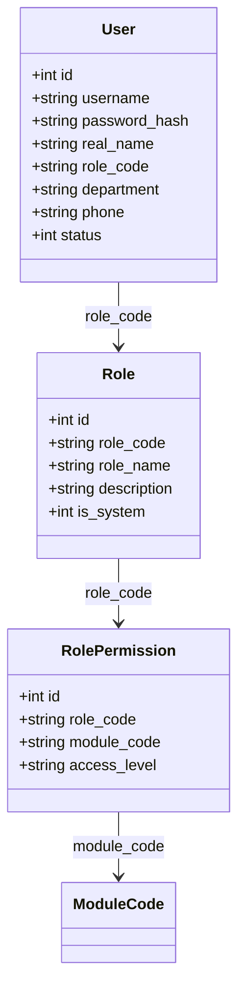
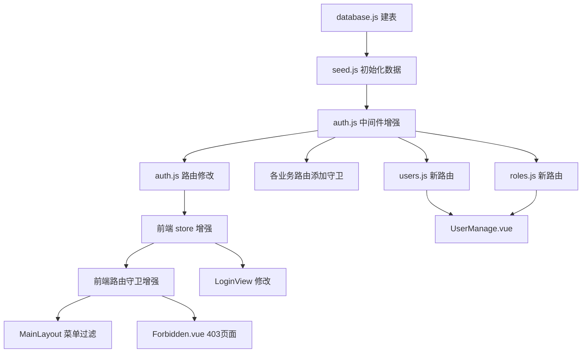

# 架构设计：多角色权限体系（RBAC）增量方案

## 一、实现方案

### 1.1 权限模型选型

采用**基于角色的访问控制（RBAC）**，P0阶段角色-权限映射硬编码，避免过早引入权限配置UI的复杂性。

**核心思路：**
- 角色（Role）是权限分配的最小单位
- 每个角色关联一组模块权限（module + access_level）
- 用户通过角色获得权限
- JWT Token只存 `userId + role`，权限每次从内存缓存读取

### 1.2 框架选型

沿用现有技术栈：
- 后端：Express + better-sqlite3
- 前端：Vue 3 + Element Plus + Pinia
- 无需新增第三方依赖

## 二、数据库设计

### 2.1 新增表

```sql
-- 角色表
CREATE TABLE IF NOT EXISTS roles (
  id INTEGER PRIMARY KEY AUTOINCREMENT,
  role_code TEXT UNIQUE NOT NULL,       -- super_admin, owner, finance_manager 等
  role_name TEXT NOT NULL,              -- 超级管理员, 企业老板 等
  description TEXT,
  is_system INTEGER DEFAULT 0,          -- 系统内置角色不可删除
  sort_order INTEGER DEFAULT 0,
  status INTEGER DEFAULT 1,
  created_at DATETIME DEFAULT CURRENT_TIMESTAMP
);

-- 角色权限表
CREATE TABLE IF NOT EXISTS role_permissions (
  id INTEGER PRIMARY KEY AUTOINCREMENT,
  role_code TEXT NOT NULL REFERENCES roles(role_code),
  module_code TEXT NOT NULL,            -- dashboard, cost, procurement, inventory, production, quality, incentive, system
  access_level TEXT NOT NULL,           -- 'full', 'read', 'none'
  created_at DATETIME DEFAULT CURRENT_TIMESTAMP,
  UNIQUE(role_code, module_code)
);
```

### 2.2 修改现有表

```sql
-- users 表增加 role_code 字段替代 role 字段
-- 兼容方案：新增 role_code 列，保留旧 role 列
ALTER TABLE users ADD COLUMN role_code TEXT DEFAULT 'staff';
-- 迁移数据
UPDATE users SET role_code = CASE
  WHEN role = 'admin' THEN 'super_admin'
  WHEN role = 'manager' THEN 'staff'
  ELSE role
END;
```

### 2.3 初始数据

```sql
-- 角色数据
INSERT INTO roles (role_code, role_name, description, is_system, sort_order) VALUES
('super_admin', '超级管理员', '系统运维管理，全权限', 1, 1),
('owner', '企业老板/总经理', '企业决策者，全模块读写+审批', 1, 2),
('finance_manager', '财务经理', '成本核算全权限，驾驶舱，质量成本，库存只读', 1, 3),
('procurement_manager', '采购主管', '采购管理全权限，库存读写，成本核算只读', 1, 4),
('production_manager', '生产主管', '生产精益全权限，质量成本读写，库存只读', 1, 5),
('warehouse_manager', '仓管员', '库存控制全权限，其他模块只读', 1, 6),
('quality_manager', '质量主管', '质量成本全权限，生产只读，库存只读', 1, 7),
('staff', '普通员工', '驾驶舱只读，改善提案提交', 1, 8);

-- 权限数据（基于PRD权限矩阵）
-- super_admin: 全部 full
-- owner: 全部 full
-- finance_manager: dashboard=full, cost=full, quality=full, inventory=read, incentive=read, procurement=read
-- procurement_manager: dashboard=read, procurement=full, inventory=full, cost=read, incentive=read
-- production_manager: dashboard=read, production=full, quality=read, inventory=read, incentive=read
-- warehouse_manager: dashboard=read, inventory=full, procurement=read, cost=read, quality=read
-- quality_manager: dashboard=read, quality=full, production=read, inventory=read, incentive=read
-- staff: dashboard=read, incentive=read (limited - 不能用分享计算器)
```

### 2.4 类图



## 三、API设计

### 3.1 新增API

| 方法 | 路径 | 权限 | 描述 |
|------|------|------|------|
| GET | /api/users | super_admin, owner | 获取用户列表（分页+搜索） |
| POST | /api/users | super_admin, owner | 新增用户 |
| PUT | /api/users/:id | super_admin, owner | 编辑用户 |
| DELETE | /api/users/:id | super_admin | 删除用户 |
| PATCH | /api/users/:id/status | super_admin, owner | 启用/禁用用户 |
| PUT | /api/users/:id/password | super_admin, owner | 重置用户密码 |
| GET | /api/roles | super_admin, owner | 获取角色列表 |
| GET | /api/permissions/my | 登录用户 | 获取当前用户权限 |

### 3.2 修改现有API

| 方法 | 路径 | 变更 |
|------|------|------|
| POST | /api/auth/login | 返回数据增加 `permissions` 和 `roleCode` |
| GET | /api/auth/profile | 新增，返回当前用户信息+权限 |
| 所有业务API | 各路由 | 添加 `requirePermission(module, level)` 中间件 |

### 3.3 登录响应变更

```json
{
  "code": 200,
  "data": {
    "token": "jwt_token...",
    "user": {
      "id": 1,
      "username": "admin",
      "realName": "管理员",
      "roleCode": "super_admin",
      "roleName": "超级管理员",
      "department": "总经办",
      "permissions": {
        "dashboard": "full",
        "cost": "full",
        "procurement": "full",
        "inventory": "full",
        "production": "full",
        "quality": "full",
        "incentive": "full",
        "system": "full"
      }
    }
  }
}
```

## 四、后端实现方案

### 4.1 权限中间件增强

```javascript
// middleware/auth.js - 新增 requirePermission
const PERMISSION_CACHE = new Map(); // role_code -> permissions map

function loadPermissions(roleCode) {
  if (PERMISSION_CACHE.has(roleCode)) return PERMISSION_CACHE.get(roleCode);
  const db = getDb();
  const perms = db.prepare(
    'SELECT module_code, access_level FROM role_permissions WHERE role_code = ?'
  ).all(roleCode);
  const map = {};
  perms.forEach(p => map[p.module_code] = p.access_level);
  PERMISSION_CACHE.set(roleCode, map);
  return map;
}

function requirePermission(moduleCode, requiredLevel = 'read') {
  return (req, res, next) => {
    if (!req.user) return res.status(401).json({...});
    const perms = loadPermissions(req.user.roleCode);
    const level = perms[moduleCode] || 'none';
    if (level === 'none') return res.status(403).json({...});
    if (level === 'read' && requiredLevel === 'full') return res.status(403).json({...});
    next();
  };
}
```

### 4.2 各路由添加权限守卫

```javascript
// 示例：cost-accounting.js
router.get('/overview', verifyToken, requirePermission('cost'), (req, res) => {...});
router.post('/materials', verifyToken, requirePermission('cost', 'full'), (req, res) => {...});
```

## 五、前端实现方案

### 5.1 路由权限配置

```javascript
// router/index.js - 增加模块权限映射
meta: {
  title: '核算总览',
  module: 'cost',           // 新增：对应 module_code
  accessLevel: 'read'       // 新增：最低需要 read 权限
}
```

### 5.2 菜单动态过滤

```javascript
// MainLayout.vue
const visibleMenuGroups = computed(() => {
  const perms = userStore.userInfo?.permissions || {};
  return menuGroups.filter(group => {
    return group.children.some(child => {
      const level = perms[child.module] || 'none';
      return level !== 'none';
    });
  });
});
```

### 5.3 路由守卫增强

```javascript
router.beforeEach((to, from, next) => {
  if (to.meta.requiresAuth !== false && !userStore.isLoggedIn) {
    next('/login');
  } else if (to.meta.module) {
    const perms = userStore.userInfo?.permissions || {};
    const level = perms[to.meta.module] || 'none';
    if (level === 'none') {
      next('/403');
    } else {
      next();
    }
  } else {
    next();
  }
});
```

### 5.4 Pinia Store 增强

```javascript
// stores/user.js - 增加 hasPermission 方法
function hasPermission(moduleCode, level = 'read') {
  const perms = userInfo.value?.permissions || {};
  const myLevel = perms[moduleCode] || 'none';
  if (myLevel === 'none') return false;
  if (myLevel === 'full') return true;
  if (myLevel === 'read' && level === 'read') return true;
  return false;
}
```

## 六、文件清单

### 6.1 新增文件

| 文件路径 | 描述 |
|---------|------|
| `backend/routes/users.js` | 用户管理API |
| `backend/routes/roles.js` | 角色查询API |
| `frontend/src/views/system/UserManage.vue` | 用户管理页面 |
| `frontend/src/views/error/Forbidden.vue` | 403页面 |

### 6.2 修改文件

| 文件路径 | 变更内容 |
|---------|---------|
| `backend/config/database.js` | 新增 roles、role_permissions 表；users 表新增 role_code 列 |
| `backend/middleware/auth.js` | 新增 requirePermission()、权限缓存、invalidateCache() |
| `backend/routes/auth.js` | 登录返回 permissions；新增 /profile 接口；register 需要权限 |
| `backend/routes/cost-accounting.js` | 所有路由添加 requirePermission 守卫 |
| `backend/routes/procurement.js` | 所有路由添加 requirePermission 守卫 |
| `backend/routes/inventory.js` | 所有路由添加 requirePermission 守卫 |
| `backend/routes/production.js` | 所有路由添加 requirePermission 守卫 |
| `backend/routes/quality.js` | 所有路由添加 requirePermission 守卫 |
| `backend/routes/incentive.js` | 所有路由添加 requirePermission 守卫（staff受限） |
| `backend/routes/dashboard.js` | 所有路由添加 requirePermission 守卫 |
| `backend/app.js` | 挂载 /api/users 和 /api/roles 路由 |
| `backend/db/seed.js` | 新增 roles、role_permissions 种子数据；更新 users 数据 |
| `frontend/src/stores/user.js` | 新增 hasPermission 方法 |
| `frontend/src/router/index.js` | 路由 meta 增加 module/accessLevel；增加403路由；增强守卫 |
| `frontend/src/views/layout/MainLayout.vue` | 菜单动态过滤；新增系统管理菜单组 |
| `frontend/src/api/index.js` | 新增 users/roles API |
| `frontend/src/views/login/LoginView.vue` | 移除注册入口（仅管理员可创建用户） |

### 6.3 依赖图



## 七、任务列表

### Task 1: 数据库迁移与种子数据
- 修改 `database.js`：新增 roles、role_permissions 表，users 表新增 role_code 列
- 修改 `seed.js`：新增角色+权限种子数据，更新用户数据的 role_code
- **依赖：无**

### Task 2: 后端权限中间件
- 修改 `middleware/auth.js`：新增 requirePermission()、权限缓存机制、缓存失效方法
- **依赖：Task 1**

### Task 3: 后端认证路由修改
- 修改 `routes/auth.js`：登录返回 permissions+roleCode+roleName，新增 /profile 接口，关闭公开注册
- **依赖：Task 2**

### Task 4: 后端用户管理+角色路由
- 新增 `routes/users.js`：用户CRUD + 启用禁用 + 重置密码
- 新增 `routes/roles.js`：角色列表查询 + 当前用户权限查询
- 修改 `app.js`：挂载新路由
- **依赖：Task 2**

### Task 5: 后端业务路由添加权限守卫
- 修改所有6个业务路由文件 + dashboard：每个路由添加 requirePermission 守卫
- **依赖：Task 2**

### Task 6: 前端 Store + 路由守卫增强
- 修改 `stores/user.js`：新增 hasPermission 方法
- 修改 `router/index.js`：路由 meta 增加 module/accessLevel，增加403路由，增强 beforeEach 守卫
- 新增 `views/error/Forbidden.vue`
- **依赖：无（可与后端并行）**

### Task 7: 前端菜单动态过滤 + 系统管理模块
- 修改 `MainLayout.vue`：菜单根据 permissions 动态过滤，新增「系统管理」菜单组
- 新增 `views/system/UserManage.vue`
- 修改 `api/index.js`：新增 users/roles API
- 修改 `LoginView.vue`：移除注册入口
- **依赖：Task 6**

### Task 8: 全局一致性审查
- 检查所有模块权限是否一致
- 检查前后端权限是否对齐
- **依赖：Task 5 + Task 7**

## 八、依赖包列表

无新增依赖包，全部使用现有依赖。

## 九、共享知识

### 9.1 模块代码约定
```
dashboard     → 成本驾驶舱
cost          → 成本核算
procurement   → 采购管理
inventory     → 库存控制
production    → 生产精益
quality       → 质量成本
incentive     → 激励中心
system        → 系统管理（用户/角色管理）
```

### 9.2 权限级别约定
- `full` = 读写 + 删除 + 导出
- `read` = 只读 + 导出
- `none` = 不可见

### 9.3 缓存失效时机
- 用户角色变更时：调用 `invalidatePermissionCache(roleCode)`
- 角色权限变更时：调用 `invalidatePermissionCache(roleCode)`

### 9.4 JWT Payload 约定
```json
{
  "id": 1,
  "username": "admin",
  "roleCode": "super_admin"
}
```
不将 permissions 放入 JWT（避免角色变更后需要重新登录）。

## 十、待明确事项

1. 注册功能是否完全关闭？建议关闭公开注册，仅管理员可创建用户
2. 密码策略：是否需要密码复杂度校验？P0阶段建议不做
3. 操作日志：P0不做，但建议在用户管理API中预留审计字段
